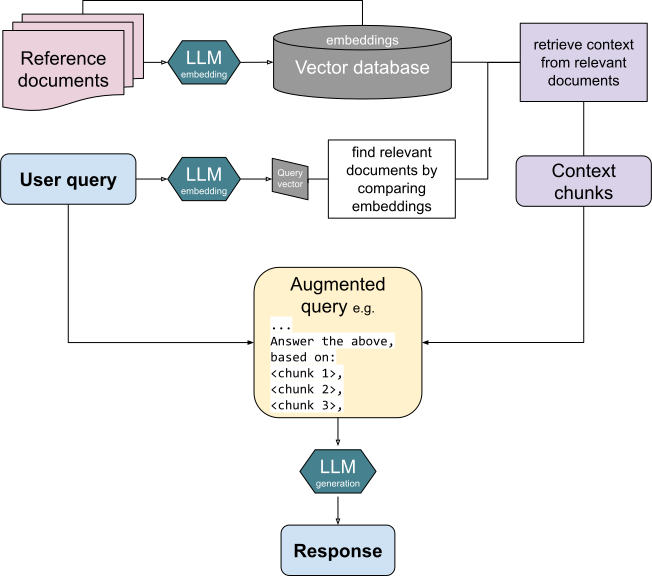
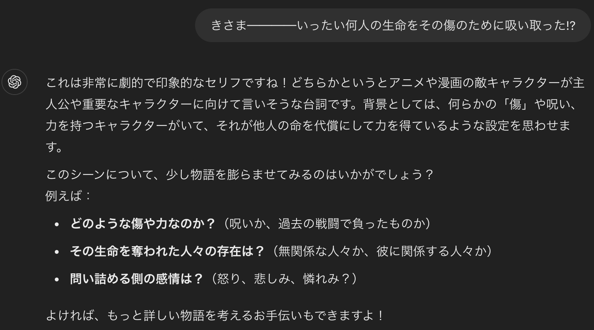

<!---
_class: title
--->

> # お前は今まで読んだドキュメントの数を覚えているのか？RAG構築で究極生命体になろう！
>

<br>
<br>
2/16(日)ぼく・わたしのエンジニアとしての生成AI活用勉強会

<br>
<br>
<br>
西田 宗太郎

---

<!-- _header: 事前準備 -->
こちらをチェックアウトして、README.mdに従って準備をしてください
https://github.com/ninomae/rag-handson


<!-- footer: Footer -->

---

<!-- _header: 自己紹介 -->
- 名前: 西田宗太郎
- 出身: 福岡
- 好きな食べ物: ラーメン、鮨、焼肉
- 職業: エンジニア
- 趣味: 開発とゲーム
    - [モンハンワイルズやりましょう](https://hackermeshi.com/communities/106)
- 好きな言語: C#、TypeScript
  

---

<!-- _header: RAGとは -->
Retrieval-Augmented Generation（以下 RAG）とは、大規模言語モデル（LLM）の生成能力と、外部の情報を取り込むための**検索（リトリーバル）**を組み合わせた手法のことです。

<!-- footer: Footer -->
[出典:wikipedia](https://en.wikipedia.org/wiki/Retrieval-augmented_generation)

---

<!-- _header: なぜRAGが必要なの？ -->
Chat GPTなどの大規模言語モデルは、生成能力が高い一方で、**情報の信頼性**や**情報の正確性**に課題があります。

例: Chat GPTに「きさま────いったい何人の生命をその傷のために吸い取った!?」と聞くと、以下のような回答が返ってきます。

<!-- footer: Footer -->

---
<!-- _header: RAGがあると？ -->

RAGがある場合
```txuperi
「きさま────いったい何人の生命をその傷のために吸い取った!?」
```

と聞くと、以下のような回答が返ってきます。

```dio
「おまえは今まで食ったパンの枚数をおぼえているのか」
```
今日はこれをどのようにして実践するのかを見ていきましょう


---

<!-- _header: 本日の技術スタック紹介 -->

<br>


---

<!-- _header: コレクションを作成してみよう -->
```bash
npm run vector:create
```
上記コマンドを実行して、下記を見てみましょう
http://localhost:6333/dashboard#/collections

---

<!-- _header: 解説: コサイン類似度 -->
```typescript
await qdrantClient.createCollection("rag_hands_on", {
	vectors: { size: 512, distance: "Cosine" },
});
```
ベクトルを比較する手法で`コサイン類似度`が使われてます

コサイン類似度は、2つのベクトルのなす角のコサイン値として定義されます。
2つのベクトルが完全に同じ方向を向いていれば 1、直交していれば 0、逆方向なら -1 になります。
1なら似ている、-1なら違うものだと覚えてもらえればと思います


---

<!-- _header: コレクションにデータを投入してみよう -->
```bash
npm run vector:upsert
```
上記コマンドを実行して、下記を見てみましょう
http://localhost:6333/dashboard#/collections


---

<!-- _header: 解説:コレクションにデータを投入してみよう -->
```typescript
// 1.open-aiに問い合わせて読み込んだデータをベクトル化
const { embeddings } = await embedMany({
    model,
    values,
});
// 2. VectorDBであるQdrantの形式に変換
const points = embeddings.map((embedding, index) => {
    return {
        id: index,
        payload: {
            value: values[index],
        },
        vector: embedding,
    };
});
// 3.QdrantにUpsert
await qdrantClient.upsert("rag_hands_on", {
    points,
});
```

---

<!-- _header: 問い合わせをしてみよう -->
```bash
npm run dev
```
上記コマンドを実行して、下記を見てみましょう
http://localhost:3000

きさま────いったい何人の生命をその傷のために吸い取った!?と聞いてみましょう

---

<!-- _header: 解説:問い合わせをしてみよう -->
```typescript
// 1. 入力した内容をベクトル化
const { embeddings } = await model.doEmbed({
    values: [query],
});
// 2. ベクトルを使って類似ドキュメントを検索
const similarDocuments = await qdrantClient.query("rag_hands_on", {
    query: embeddings[0],
    limit: 5,
    with_payload: true,
});
// 3. 類似ドキュメントを使って回答を生成
const text = await generateText({
    model: openai("gpt-4o-mini"),
    prompt: `以下にユーザーの質問と類似ドキュメントを示します。
ユーザーの質問から、類似ドキュメントに対する回答を示してください。
		
### ユーザーの質問
${query}

### 類似ドキュメント		
${similarDocuments.points.map((doc) => doc.payload?.value).join("\n")}
`,
});
```

---

<!---
_class: title
--->

# ※ハンズオンは以上ですお疲れ様でした︕


